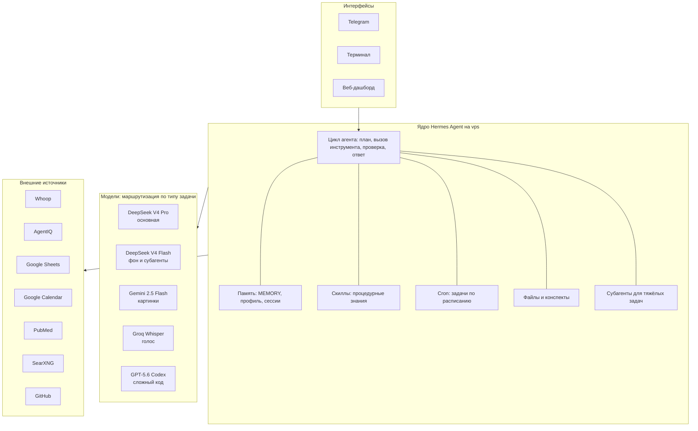

В апреле я поставил на сервер ai-ассистента. Не чат-бота, не кнопку «сгенерировать текст». Цифрового сотрудника, который живёт отдельно от меня и работает круглосуточно.

Назвал Майком, в честь Майкрофта Холмса, суперкомпьютера HOLMES IV из романа Хайнлайна «Луна, суровая хозяйка». Там компьютер однажды набрал критическую массу нейристоров и проснулся к самосознанию. Мой пока не проснулся, но за три с половиной месяца оброс сотней навыков и знает про мои проекты больше, чем половина команды.

## Архитектура: четыре слоя

Устройство проще, чем кажется. Всё делится на четыре слоя, и каждый можно менять независимо от остальных.

**Слой интерфейсов.** Telegram как основной вход, терминал когда сижу за компьютером, веб-дашборд для настроек. Hermes из коробки умеет ещё Discord, Slack, WhatsApp, Signal и почту. Важное здесь не количество, а то, что память общая. Начал разговор голосом в машине, продолжил текстом с ноутбука, Майк помнит обе половины.

**Ядро.** Цикл агента, маршрутизация запросов, память, скиллы, планировщик. Живёт на vps за десять долларов в месяц. Это единственная часть, которую я не менял ни разу.

**Слой моделей.** Здесь самое интересное, про него ниже.

**Слой интеграций.** Whoop отдаёт сон и нагрузку, AgentIQ лиды, Google Sheets финансы, PubMed научные статьи, SearXNG поиск без слежки, GitHub деплой блога.

## Модели: пять вместо одной

Основную работу делает **DeepSeek V4 Pro**. Быстрая, недорогая, контекст 65 тысяч токенов. На ней идут ответы на вопросы, разбор данных, тексты, работа с файлами.

**DeepSeek V4 Flash** обслуживает фон: сжимает длинные диалоги, вытаскивает содержимое сайтов, придумывает заголовки сессий. На ней же работают субагенты, когда основной модели нужно делегировать долгий поиск. Стоит копейки и не забивает основной контекст.

**Gemini 2.5 Flash** через OpenRouter отвечает за картинки. Скидываю фото еды, он считает калории и белок. Фото документа, читает текст. Скриншот, разбирает что на нём. DeepSeek картинки не умеет, поэтому отдельная модель.

**Groq Whisper** распознаёт голос. Диктую на ходу, Майк слышит. Быстрее, чем печатать.

**GPT-5.6 Codex** подключается на сложный код: рефакторинг, новый модуль, архитектурные решения. Идёт через подписку ChatGPT, то есть расходует её лимиты, а не платится за каждый ответ.

### Почему не одна модель на всё

У каждой задачи своя цена и своя сложность. Отправить «посмотри картинку» в DeepSeek нельзя, он не умеет. Гонять reasoning-модель на «во сколько встреча» глупо, она будет думать восемь секунд там, где хватает двух.

Часть маршрутизации автоматическая и прописана в конфиге: картинки уходят в Gemini, голос в Whisper, сжатие в Flash. Это происходит без моего участия. А вот тяжёлые задачи в Codex Майк отправляет по инструкции в системном промпте, то есть решает сам. Иногда не решает и делает сам, тогда я говорю прямо: отдай кодексу.

## Самообучение: скиллы, которые пишутся сами

Это то, чего нет в обычных приложениях.

Когда Майк решает сложную задачу, он записывает процедуру в отдельный файл-скилл. Не я его пишу, он сам. Разобрался, как считать калорийность по фото, появился скилл «анализ еды». Собрал и выкатил блог на Astro, появился скилл «деплой блога». В следующий раз он не изобретает решение заново, а открывает готовую инструкцию.

Сейчас у него больше сотни таких скиллов. Самые ходовые за три месяца: коучинг, разбор еды, финансовое моделирование, трудовое право, стиль моих текстов.

Дальше включается второй механизм. Раз в неделю фоновая задача просматривает библиотеку скиллов, помечает те, которыми давно не пользовались, и убирает их в архив. На прошлой неделе так уехали сорок три штуки: notion, obsidian, powerpoint, работа с arxiv. Ничего из этого я не открывал месяцами, и каждый висел лишним весом в контексте.

Разница с приложением простая. В приложении ты каждый раз объясняешь заново. Здесь объясняешь один раз, дальше это его знание.

## Модельная свобода

Я не привязан к одному вендору, и это не идеология, а страховка.

За три месяца Майк успел поработать на gpt-5.5, на DeepSeek и на Gemini. Один раз квота подписки кончилась в тот же день, когда на балансе api закончились деньги, и он замолчал совсем. Починка заняла двадцать минут: переключить основную модель на живого провайдера и назначить запасного.

Теперь у него всегда есть запасной вариант. Основная модель падает, включается резервная, разговор продолжается. Ни одно приложение так не умеет: там модель зашита в продукт, и если вендор поднял цену или сломал тариф, вариантов нет.

## Скорость: где на самом деле уходит время

Сначала Майк отвечал за пятнадцать секунд, а на задачах со свежими данными и за сорок. Это раздражало сильнее всего.

Первым делом я полез резать инструменты, потому что их описания занимают половину системного промпта. Оказалось, мимо. Я разобрал по шагам один медленный ответ и увидел, что вызовы инструментов занимают доли секунды. Всё время съедали обращения к модели.

Что действительно сработало:

**Сменить модель.** Reasoning-модель думает перед ответом даже над «привет». На gpt-5.5 один обмен стоил от восьми до семнадцати секунд. На DeepSeek V4 Pro тот же обмен занимает от двух с половиной до восьми.

**Запретить лишние походы.** В системном промпте раньше стояло «перед задачей проверь память и скиллы». Майк послушно шёл проверять на любой вопрос, и каждый такой заход добавлял ещё один круг к модели. Теперь правило другое: на простой вопрос отвечай сразу, инструменты только когда без них не обойтись.

**Уводить тяжёлое в сторону.** Многошаговый поиск уходит субагенту на лёгкой модели. Он работает в фоне и не раздувает основной диалог.

**Сжимать контекст.** На 45 процентах окна история автоматически ужимается: суть остаётся, повторы уходят. Без этого диалог за день распухает до ста тысяч токенов, и каждый следующий ответ становится медленнее предыдущего.

Итог: простой вопрос сейчас занимает около шести секунд вместо пятнадцати. Не мгновенно. Обмен с моделью физически стоит несколько секунд, и обещать здесь одну секунду было бы враньём.

## Память

У Майка три вида памяти, и это ближе к устройству человека, чем к базе данных.

**Факты обо мне.** Рост, вес, цели по питанию, добавки, лекарства, привычки. Восемь тысяч символов.

**Факты о проектах.** Контакты, статус паста-бара, метрики бизнесов, договорённости. Тоже восемь тысяч.

**Процедуры.** Те самые скиллы: не что я знаю, а что я умею делать.

Плюс текстовые инбоксы, которые я веду руками: задачи на день, идеи для контента, бизнес-гипотезы, конспекты прочитанного.

За долговременную часть отвечает Honcho, отдельный внешний сервис, подключённый к Hermes плагином. Он смотрит на диалоги и достраивает профиль сам, без моего участия. Ищет не по ключевым словам в текущем чате, а по всем сессиям сразу, семантикой. Могу спросить «что я говорил про паста-бар в мае», и он найдёт.

## Задачи по расписанию

Три раза в день Майк пишет первым, не дожидаясь вопроса:

- 9:00, отчёт по лидам из AgentIQ
- 9:30, задачи на день из TODO.md
- 10:00, сводка здоровья из Whoop, восстановление и сон

Это и есть главное отличие от чата. Чат ждёт, пока к нему придут. Майк работает, пока я сплю, и приносит результат.

## Приватность

Данные лежат на моём сервере. Клиентские базы, финансовые таблицы, переписка с командой не уезжают в облако Anthropic или OpenAI целиком. В модель уходит только то, что нужно для конкретного ответа.

Для части задач это решающий фактор. Финмодель компании я не понесу в публичный чат-интерфейс, а локальному агенту отдам.

## Кому это не нужно

Честно: большинству не нужно.

Если задачи умещаются в «сформулировал, получил ответ, закрыл», обычное приложение закроет девяносто процентов потребностей и не потребует ни настройки, ни сервера, ни разбирательств с конфигом в полночь. На форумах Hermes регулярно всплывает вопрос в духе «зачем это всё, если есть готовые продукты», и у скептиков сильный аргумент.

Разница проявляется на другом масштабе. Когда нужна память между сессиями, а не в пределах одного окна. Когда задачи повторяются, и хочется, чтобы решение сохранялось. Когда работа должна идти без тебя и по расписанию. Когда данные нельзя выносить наружу.

Это не «Hermes лучше». Это разная глубина. Приложение приносит по запросу, агент живёт своей жизнью и докладывает.

## Сколько стоит

Порядка ста долларов в месяц: сервер, api моделей, подписка на Codex, облачные сервисы. Основная модель при этом самая дешёвая часть, копейки за тысячи запросов, потому что дорогие модели включаются только там, где действительно нужны.

Настройка заняла три месяца вечеров. Половина из них ушла не на возможности, а на надёжность: чтобы не падал, не забывал, не зависал на ровном месте.

Сейчас он делает утренние отчёты, считает мою еду по фотографиям, разбирает финансовые модели, помнит контекст всех проектов и пишет черновики моим голосом. Пока не проснулся, но нейристоры копит.
