Неделю назад настроил себе AI-ассистента. Не чат-бота, не кнопку «сгенерировать текст». Полноценного цифрового сотрудника, который живёт на своём сервере и работает 24/7.

Назвал Майком — в честь Майкрофта Холмса, суперкомпьютера HOLMES IV из романа Хайнлайна «Луна — суровая хозяйка». Там компьютер однажды набрал критическую массу нейристоров и проснулся к самосознанию. Мой пока не проснулся, но делает работу трёх человек.

## Архитектура: что под капотом

```mermaid
graph TB
    subgraph "Интерфейсы"
        TG[Telegram]
        CLI[Терминал]
    end

    subgraph "Hermes Agent на VPS"
        CORE[Ядро агента<br/>маршрутизация • память • цикл]
        MEMORY[(Память<br/>MEMORY + профиль)]
        SKILLS[(Скиллы<br/>процедуры)]
        CRON[Планировщик<br/>cron-задачи]
        FS[Файловая система<br/>заметки • TODO • конспекты]
    end

    subgraph "Модели"
        MAIN[DeepSeek V4 Pro<br/>основная модель]
        FLASH[DeepSeek V4 Flash<br/>вспомогательные задачи]
        GEMINI[Gemini 2.5 Flash<br/>через OpenRouter<br/>vision • изображения]
        GROQ[Groq Llama 3.3 70B<br/>распознавание речи]
        CODEX[GPT-5.6 Codex<br/>по подписке<br/>сложный код • рефакторинг]
    end

    subgraph "Интеграции"
        WHOOP[Whoop API<br/>strain • recovery • сон]
        AIQ[AgentIQ API<br/>лиды каждый день]
        GSHEETS[Google Sheets<br/>финансы • модели]
        GCAL[Google Calendar<br/>встречи • напоминания]
        PUBMED[PubMed<br/>исследования]
        WEB[Веб-поиск<br/>SearXNG]
        GITHUB[GitHub API<br/>деплой блога]
    end

    TG <--> CORE
    CLI <--> CORE
    CORE --> MAIN
    CORE --> FLASH
    CORE --> GEMINI
    CORE --> GROQ
    CORE -.-> CODEX
    CORE <--> MEMORY
    CORE <--> SKILLS
    CORE <--> CRON
    CORE <--> FS
    CORE --> WHOOP
    CORE --> AIQ
    CORE --> GSHEETS
    CORE --> GCAL
    CORE --> PUBMED
    CORE --> WEB
    CORE --> GITHUB
```

## Модели и зачем их несколько

**Основная — DeepSeek V4 Pro.** Быстрая и недорогая. На ней идут все повседневные задачи: ответы на вопросы, анализ данных, написание текстов, работа с файлами. Контекст — 65 тысяч токенов, хватает на часовой диалог с документами.

**Вспомогательная — DeepSeek V4 Flash.** Лёгкая версия той же модели. Используется для фоновых задач: сжатие длинных диалогов, извлечение контента из сайтов, автоматические заголовки, модерация. Стоит копейки, не нагружает основной контекст.

**Vision — Gemini 2.5 Flash через OpenRouter.** Когда скидываю фото еды — считает КБЖУ. Фото документов — читает. Скриншоты — разбирает что на них. DeepSeek картинки пока не умеет, поэтому отдельная модель.

**Распознавание речи — Groq Whisper.** Диктую голосом — Майк слышит. Быстрее чем печатать, особенно в дороге.

**Codex (GPT-5.6) — для сложного кода.** Когда задача выходит за пределы «поправь строчку»: рефакторинг, новый модуль, архитектурные решения. Подключается только по необходимости — дорогой, мощный.

### Почему не одна модель для всего

Потому что у каждой задачи своя цена и своя сложность. Отправлять запрос «посмотри картинку» на DeepSeek нельзя — не поддерживает. Гонять GPT-5.6 на простые вопросы — $0.50 за ответ вместо $0.02. Whisper для голоса — бесплатно через Groq.

Маршрутизация автоматическая: Hermes сам выбирает модель под задачу.

## Настройки скорости: как я выжал отклик до секунд

Первые дни Майк отвечал за 5-8 секунд. Бесило. Я перекопал всё что можно, теперь на простой вопрос ответ приходит за 1-2 секунды.

Вот что сделал:

**Правило инструментов в голове.** Каждый вызов инструмента (поиск, чтение файла, память) стоит 3-8 секунд, это дополнительный запрос к модели. Поэтому я запретил Майку сверяться со скиллами и памятью «на всякий случай». Простой вопрос, ответ из головы, сразу. Инструменты только когда без них нельзя: свежие факты, цифры, файлы, система.

**System prompt без воды.** В системном промпте жёсткая директива: «Быстрый режим: коротко и конкретно». Никаких вежливых обёрток, никаких «давайте я вам помогу». Ответ, и погнали.

**Маршрутизация нагрузки.** Не всё гоняется через одну модель:
- Сложный код и рефакторинг → Codex (gpt-5.6), отдельная подписка
- Глубокий ресёрч с 2+ поисками → субагент, который работает в фоне и не забивает основной контекст
- Если web_search падает дважды → стоп, не зацикливаться

**Сжатие контекста.** Когда диалог переваливает за 45% окна, Hermes автоматически сжимает историю: оставляет суть, выбрасывает повторы. Работает как garbage collector в голове, не даёт контексту распухнуть и замедлить каждый следующий ответ.

**Модели под задачу, а не одна для всего.** Об этом выше, но это ключевое. DeepSeek V4 Pro для обычной работы, Flash для фона, Gemini для картинок, Groq для голоса. Ни одна модель не делает всё хорошо, и не должна.

Результат: Майк отвечает быстрее, чем я печатаю вопрос.

## Долговременная память и Honcho

У Майка есть долговременная память. Не как у чат-бота «запомни контекст на 10 сообщений», а полноценная. За неё отвечает **Honcho** — подсистема Hermes, которая наблюдает за каждым диалогом и строит профиль в фоне.

### Что хранится

- **MEMORY** — что знает обо мне и проектах: предпочтения, контакты, текущие задачи паста-бара, KPI бизнесов. Выжимка самого важного на 8000 символов.
- **Профиль** — мои характеристики: рост, вес, цели по КБЖУ, добавки, лекарства. Тоже 8000 символов.
- **Скиллы** — процедурная память. Например скилл «анализ еды» знает как считать калорийность по фото. «Деплой блога» — как собрать Astro и запушить на GitHub Pages. Создаются автоматически после успешных сложных задач.
- **TODO.md, IDEAS.md, BUSINESS.md** — текстовые инбоксы. Задачи на день, идеи для контента, бизнес-гипотезы.
- **Конспекты** — всё что читаю или изучаю, сохраняется в `konspekty/`. Поиск по всем файлам.

### Как работает Honcho

Honcho — это не база данных «ключ-значение». Это слой поверх LLM, который постоянно наблюдает за диалогом и делает пять вещей:

**Автоматический профиль.** Без ручного заполнения. Honcho смотрит на каждую сессию и сам решает, что важно запомнить: предпочтения, привычки, контекст проектов. Профиль обновляется после каждого диалога и вкалывается в начало каждой новой сессии.

**Поиск по всей истории.** Это не «поиск по ключевым словам в текущем чате», а гибридный поиск (семантический + ключевые слова) по всем сессиям. Майк может спросить: «что Иван говорил про паста-бар три недели назад?» — и получит точную цитату.

**Синтез знаний.** Если вопрос сложный — «какая у Ивана стратегия питания и почему она менялась» — Honcho запускает вспомогательную LLM, которая собирает факты из всех сессий и синтезирует ответ. Пять уровней глубины: от быстрого факт-чека до полного аудита.

**Контекстный снимок.** В начале каждой сессии Honcho даёт сжатый снимок: карточка профиля, саммари прошлых диалогов, последние сообщения. Майк не начинает с чистого листа — он уже в курсе.

**Выводы.** После значимых решений Honcho сохраняет их как отдельные утверждения. Если потом появляются противоречащие факты — система сама корректирует выводы.

### Почему это важно

Обычный чат-бот забывает всё после `/new`. Майк помнит. Не потому что я хороший промпт-инженер, а потому что под капотом работает Honcho — система долговременной памяти, которая не требует ручного ведения базы знаний. Я просто общаюсь, а профиль строится сам.

## Автоматизация: cron-задачи

Майк работает даже когда я сплю. Настроены регламентные задачи:

| Задача | Когда | Что делает |
|--------|-------|------------|
| Лиды AgentIQ | 9:00 МСК | Отчёт по новым лидам |
| Задачи на день | 9:30 МСК | Даёт список дел из TODO.md |
| Whoop-сводка | 10:00 МСК | Strain, recovery, сон, рекомендация |

Каждая задача — запуск скрипта, результат приходит в Telegram готовым текстом. Ни одной кнопки не нажимаю.

## Интеграции с внешними сервисами

- **Whoop API** — прямое подключение к v2 API. Ежедневно: восстановление, нагрузка, сон, пульс. Без посредников, без whoopy-обёрток.
- **AgentIQ** — внутреннее API сервиса. Лиды в реальном времени.
- **Google Sheets + Calendar** — OAuth-токен. Финансовые модели, планирование встреч. Майк может создать событие в календаре и записать цифры в таблицу.
- **PubMed** — поиск исследований по добавкам, здоровью, биохакингу. Только evidence-based.
- **SearXNG** — приватный поисковый движок на том же сервере. Без трекинга, без рекламы.
- **GitHub API** — деплой этого блога и других проектов.

## Что Майк делает каждый день

**Утро.** Я просыпаюсь — в Telegram уже три сообщения: лиды AgentIQ (сколько новых, откуда), задачи на сегодня (TODO.md), данные Whoop (зелёный/жёлтый/красный, что с нагрузкой).

**День.** Скидываю фото еды — считает КБЖУ и показывает остаток до дневной нормы. Спрашиваю «кого из клиентов разбудить» — лезет в заметки. Надо собрать блог — делает сборку и деплой. Надо найти исследование про креатин и задержку воды — ищет PubMed, даёт выжимку.

**Вечер.** Сохраняю идеи на завтра. Майк записывает всё что я сказал, раскладывает по файлам.

## Что изменилось

**Скорость.** Раньше: идея → открыть 10 вкладок → забыть. Теперь: идея → спросить Майка → получить данные → решить или отложить. То, на что уходил час ручного поиска — один запрос.

**Фокус.** Перестал держать в голове сто мелких «не забыть бы». Майк помнит всё: когда последний раз курил кальян, сколько белка съел, кого из клиентов пора разбудить, какой у меня пульс был вчера в 3 часа ночи.

**Петли принятия решений стали короче.** Меньше прокрастинации, больше действия. Не потому что я стал дисциплинированнее — потому что трение между мыслью и результатом исчезло.

## Сколько стоит

| Компонент | Цена |
|-----------|------|
| VPS (Ubuntu 22.04, 2 ядра, 4 ГБ) | ~$10/мес |
| DeepSeek API (основная + flash) | ~$50–70/мес |
| OpenRouter Gemini (vision) | ~$2–5/мес |
| Groq Whisper (голос) | бесплатно |
| Codex GPT-5.6 | ~$20–50/мес |
| **Итого** | **~$90–135/мес** |

Цифровой сотрудник, который не спит, не болеет, не просит зарплату и работает 24/7. За $100 в месяц.

Не считая часов моего времени, которые освободились. А это уже совсем другие деньги.

---

*Это первая статья в блоге. Дальше буду писать о предпринимательстве, AI и здоровье — в таком же формате: что сделал, какие цифры, что получилось.*
